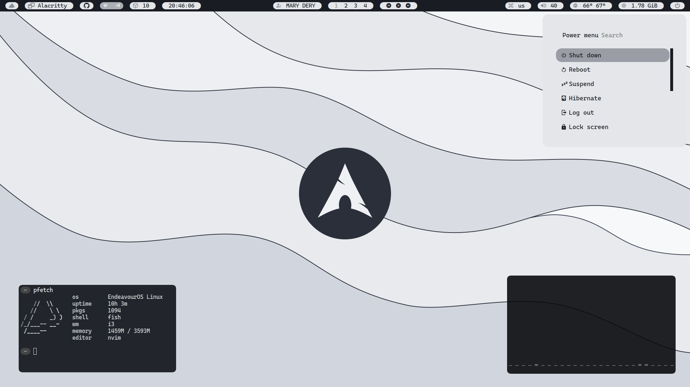

# dotfiles
 ==Welcome==, this is my dotfiles for **r/unixporn** users, *and not only*

### Configuration of what is here

- [i3-wm](https://wiki.archlinux.org/title/I3)
- [alacritty](https://wiki.archlinux.org/title/Alacritty)
- [fish](https://wiki.archlinux.org/title/Fish)
- [neovim](https://wiki.archlinux.org/title/Neovim) ([nvchad](https://nvchad.com/))
- [picom](https://wiki.archlinux.org/title/Picom)
- [polybar](https://wiki.archlinux.org/title/Polybar)
- [rofi](https://wiki.archlinux.org/title/Rofi)

### Dependencies

- Alacritty Terminal

  ```shell
  sudo pacman -S alacritty
  ```

- Fish Shell

  ```shell
  sudo pacman -S fish
  ```

- I3 Windows Manager

  ```shell
  sudo pacman -S i3-wm picom polybar feh
  pip install pywal
  ```

- Neovim

  ```shell
  sudo pacman -S neovim nodejs npm
  ```

  [NvChad install](https://nvchad.com/docs/quickstart/install)

- Picom Compositor

  ```shell
  sudo pacman -S picom
  ```

- Polybar Bar

  ```shell
  sudo pacman -S polybar
  pip install pywal
  ```

- Rofi Menus

  ```shell
  sudo pacman -S rofi rofi-emoji rofi-power-menu
  ```

### How to install this dots

Just *replace* the standard (or your own, **but save them first**) program configuration files with these files

### Screenshots

> 
>
> 
>
> 
>
> 
>
> 
>
> 
>
> 
